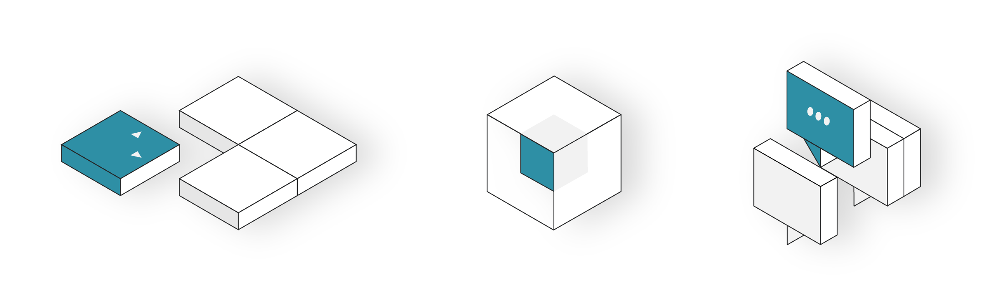
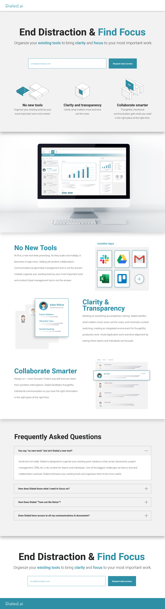

> Landing page built for Dialed.ai

 

### Project Background

Dialed.ai is a platform designed to bring clarity and focus to your work. To advertise early access, the Dialed team was looking for a stophisticated-yet-minimalist landing page that teased their product features and highlighted its brand values.

####[Visit Dialed.ai](https://dialed.ai/)

### Built With

I built the Dialed landing page using Jekyll, a Ruby-based static site generator. The graphics and brand assets were designed in Adobe Illustrator. The static comps were designed in Adobe XD.

<ul style="margin-left: 40px;">
   <li>
      <a href="https://jekyllrb.com/">Jekyll</a>
   </li>
   <li>
      <a href="https://www.adobe.com/products/illustrator.html">Adobe Illustrator</a>
   </li>
   <li>
      <a href="https://www.adobe.com/products/xd.html">Adobe XD</a>
   </li>
</ul>

### Static Comps

 
