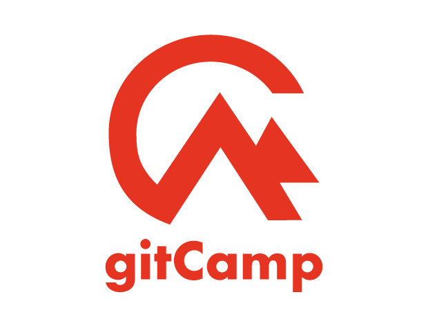

> Project collaboration platform built using the GitHub API

 

### Project Background

When I was learning to code, I loved teaming up with people to create amazing applications using exciting new technologies. However, collaborating using git-based workflows can be overwhelming and frustrating for students and beginners. That's why I created gitCamp.

GitCamp provides a streamlined intro to git-based collaboration by allowing users to create projects, invite collaborators, and create, manage, and assign tasks on an easy-to-use platform. Featuring full integration with github's API, all activities are mirrored on users' github profiles - for example, creating a new gitCamp project also initializes a new repository on github and tasks open new issues - allowing them to seamlessly transition to github when they're ready.

####[Visit gitCamp](https://gitcamp.net) | [View Source](https://github.com/gabrielkuettel/gitCamp)

### Built With
I built gitCamp using Node and Express for the backend, PassportJS and github OAuth for authentication, Mongoose as an ODM for the MongoDB database, and React for a dynamic user experience.
<ul style="margin-left: 40px;">
   <li>
      <a href="https://nodejs.org/en/">Node</a>
   </li>
   <li>
      <a href="https://expressjs.com/">Express</a>
   </li>
   <li>
      <a href="https://mongoosejs.com/">Mongoose</a>
   </li>
   <li>
      <a href="http://www.passportjs.org/">Passport</a>
   </li>
   <li>
      <a href="https://reactjs.org/">React</a>
   </li>
    <li>
      <a href="https://material-ui.com/">Material-UI</a>
   </li>
</ul>

### Features 
<ul style="margin-left: 40px;">
   <li>Create and manage projects</li>
   <li>Add, edit, delete tasks, and organize them by category.</li>
   <li>Projects and tasks are synced to github as repositories and issues</li>
   <li>View and invite mutual followers ('friends') to collaborate</li>
</ul>

### Demo

<video style="padding: 0 0 40px 0;" width="100%" controls autoplay loop>
    <source src="gitcamp-demo-video.mp4" type="video/mp4">
</video>
