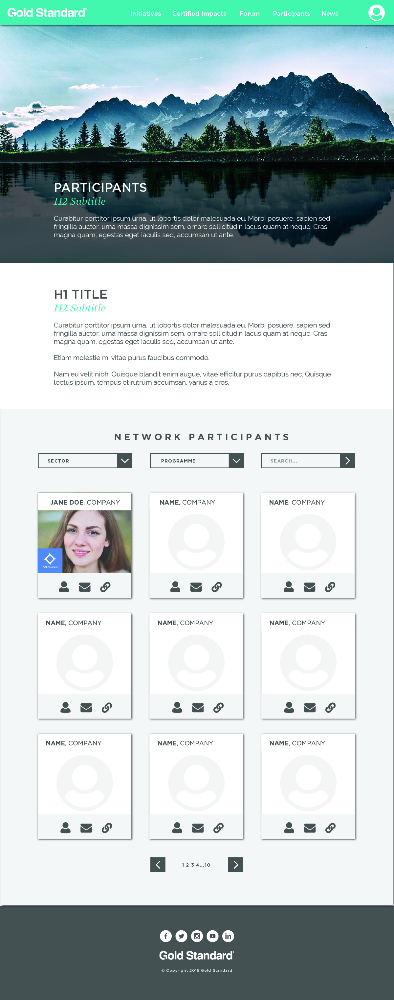
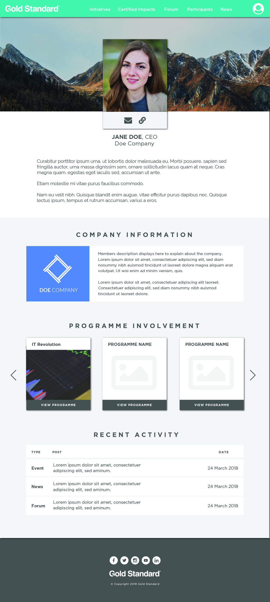
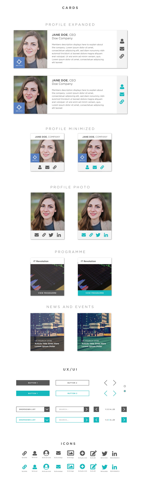

> UX/UI design for [Gold Standard Platform](https://platform.goldstandard.org/home)

### Project Background 

The Gold Standard Platform is a collaboration platform that aims to mobilize partnerships and facilitate structured programmes to create concrete outcomes. I envision the UX/UI and designed static comps for the frontend using Adobe Illustrator and Adobe Photoshop.

### Home Page

### Participants Page

### Dashboard

### UI Kit

