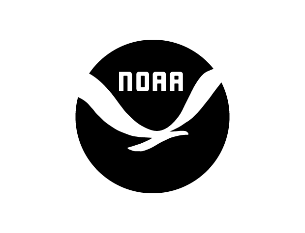

> Scrape news from NOAA, leave comments on articles, and save them for later.

 

### Project Background

NOAA provides excellent news and content on the state of our climate and environment. To make it easier to consume this content and take notes for my own research, I built NOAA Scraper, which lets you scrape the [National Oceanic and Atmospheric Administration](https://www.noaa.gov/) for the latest news on our climate, oceans and enviornment, comment on articles, and save them to read later.

####[Visit NOAA Scraper](https://noaa-scraper.herokuapp.com) | [View Source](https://github.com/gabrielkuettel/noaa-scraper)

### Built With
I built NOAA Scraper using Node and Express for the backend, Mongoose as an ODM for the MongoDB database, Handlebars as a templating engine, and Bootstrap MD, an open-source Material variant of Bootstrap.
<ul style="margin-left: 40px;">
   <li>
      <a href="https://nodejs.org/en/">Node</a>
   </li>
   <li>
      <a href="https://expressjs.com/">Express</a>
   </li>
   <li>
      <a href="https://mongoosejs.com/">Mongoose</a>
   </li>
   <li>
      <a href="https://handlebarsjs.com/">Handlebars</a>
   </li>
    <li>
      <a href="https://fezvrasta.github.io/bootstrap-material-design/">Bootstrap MD</a>
   </li>
</ul>

### Features 
<ul style="margin-left: 40px;">
   <li>Scrape articles from NOAA.</li>
   <li>Leave comments on articles.</li>
   <li>Save articles to read later.</li>
</ul>

### Demo

<video style="padding: 0 0 40px 0;" width="100%" controls autoplay loop>
    <source src="noaa-scraper-demo-video.mp4" type="video/mp4">
</video>