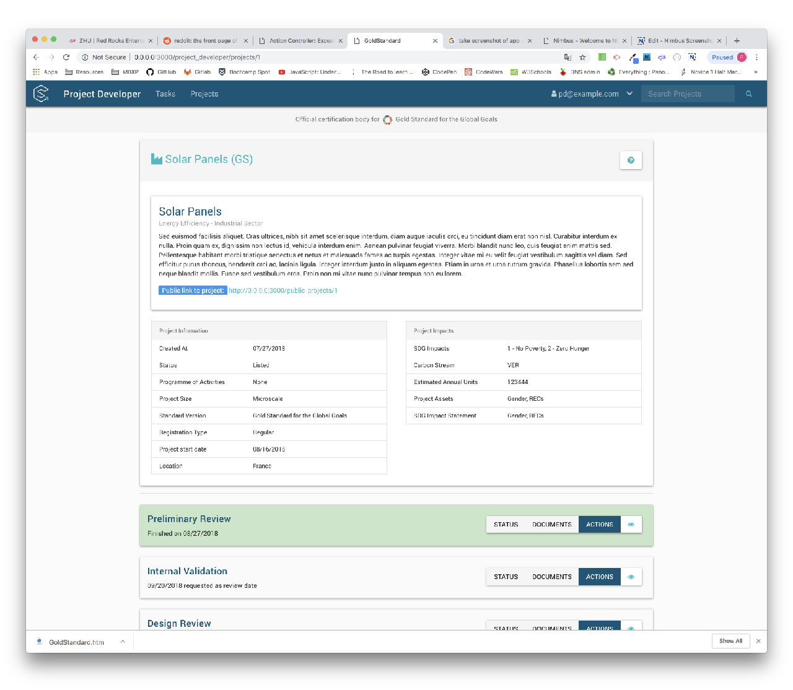
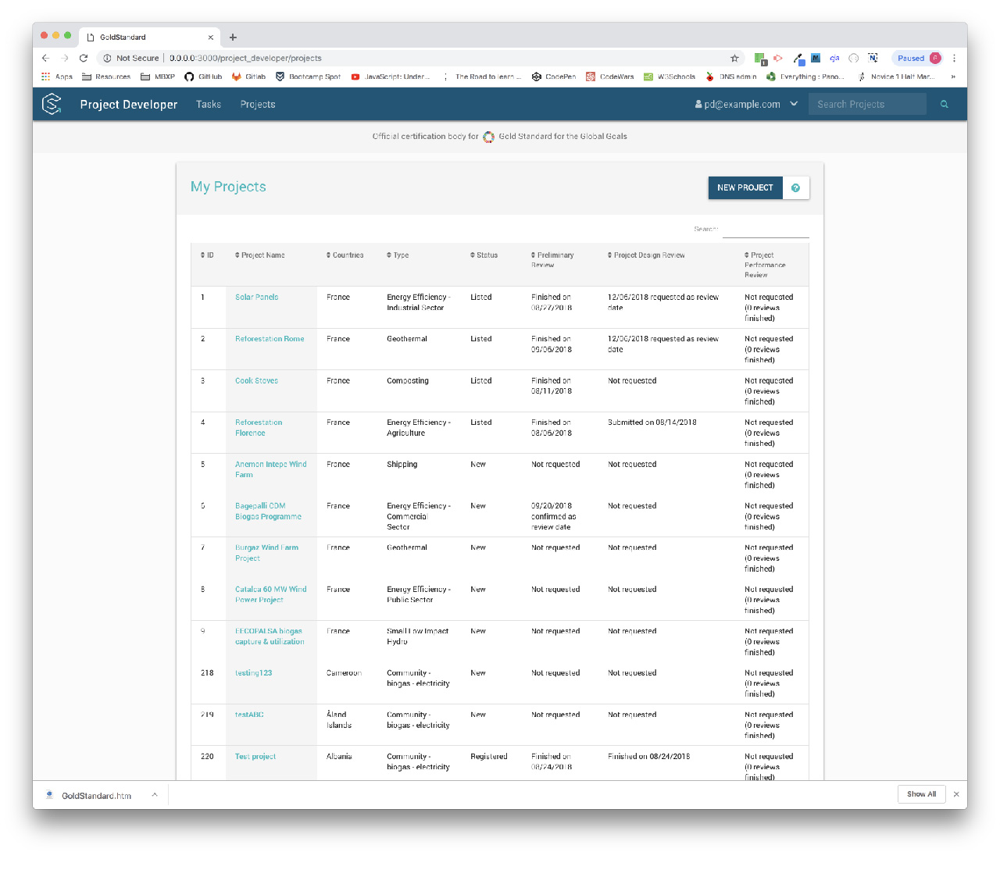

> Frontend Development for <a href="https://impact.sustain-cert.com/">SustainCERT</a>

### Project Background

SustainCERT's Project Developer portal is an online application used by wind, solar, and other climate-related project developers to track their impacts. I developed the front-end using HTML/CSS, Bootstrap 4, jQuery, and Material Design principles.

### Project Dashboard

### Tasks View

### Projects View

