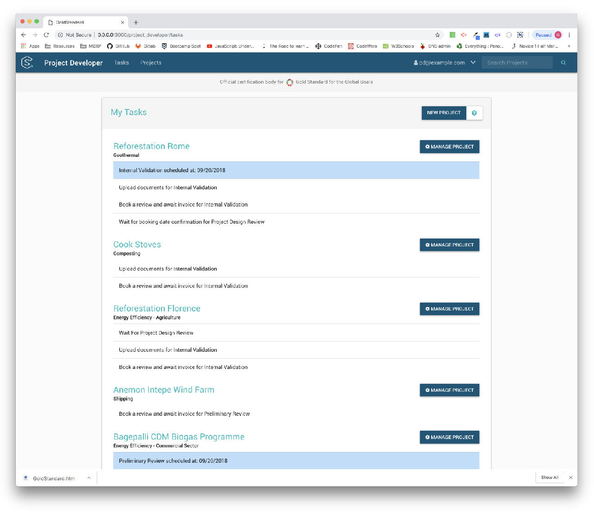

SustainCERT's Project Developer portal is an online application used by wind, solar, and other climate-related project developers to track their impacts. I developed the front-end using HTML/CSS, Bootstrap 4, jQuery, and Material Design principles.

####[Visit Website](https://impact.sustain-cert.com/)

#### Project Dashboard

#### Tasks View

#### Projects View

