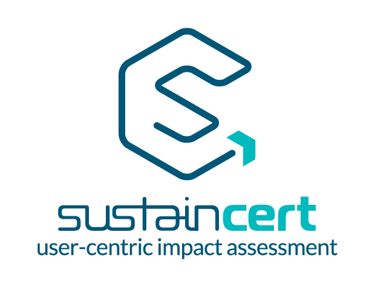
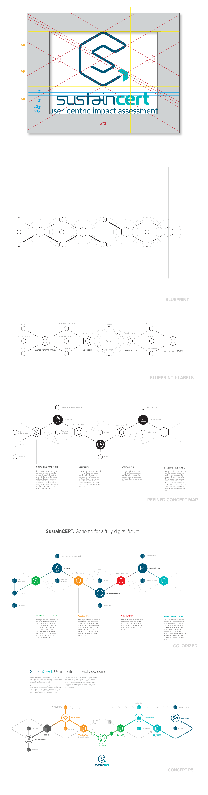

> Brand identity design for <a href="https://sustain-cert.com">SustainCERT</a>.

### Project Background

SustainCERT is a company committed to delivering flexible, tech-driven solutions for climate change. Leading up to the launch, I worked with SustainCERT's interim CEO and marketing director to create an identity that captured this forward-looking mission.

A core pledge of SustainCERT is to enable blockchain-based technologies to make it easier for wind, solar, and other climate-related projects to certify their impacts in a credible and robusty way. I endeavored to capture this pledge in the design of SustainCERT's identity through a sophisticated and modern design that evokes its cutting-edge mission.

This process involved a lot of exploration, pen-and-paper brainstorming, and concepting. Below is a brief 'outtake' from this process.

### Process Outtakes

